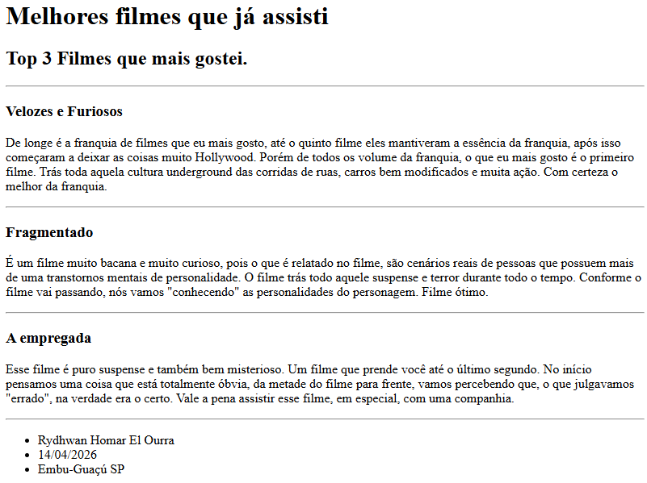
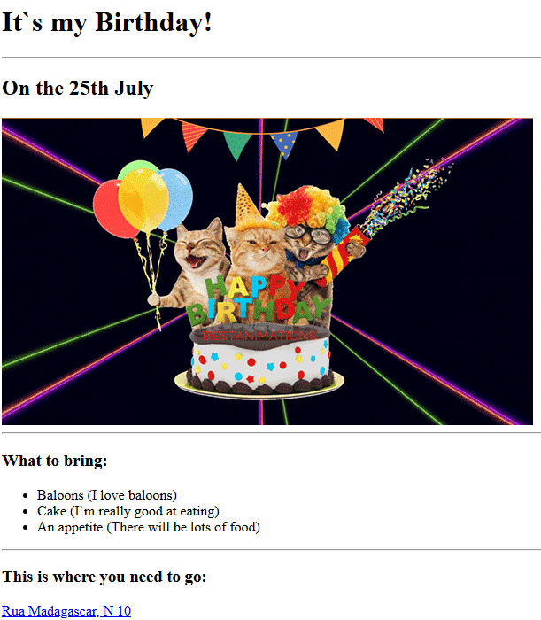

<h1>primeiro-projeto-html</h1>

Neste projeto, usei um pouco tudo que aprendi com html até agora. Em breve, terei um site bem mais completo, com css e javascript. Deixarei as linhas de códigos no readme. Tenho uma pasta com todos os codes e projetos que já fiz até agora.

<!DOCTYPE html>
<html lang="en-US">
  <head>
     <meta charset="UTF-8">
     <title>Projetos - Rydhwan H El Ourra</title>
  </head>
  <body>
      <h1>Meus projetos - Rydhwan H. El Ourra</h1>
      <h2>Desenvolvedor Web em formação</h2>
      

      <h3><a href="./top-3-filmes-ranking-rydhwan.html">Projeto Ranking de filmes</a></h3>
      
      

      <h3><a href="./convite-de-aniversario-rydhwan.html">Projeto Convite de Aniversário</a></h3>
      
      

      <h3>
         <a href="./about.html">Sobre mim</a>
         <a href="./contact.html">Fale comigo</a>
      </h3>
  </body>
</html>
